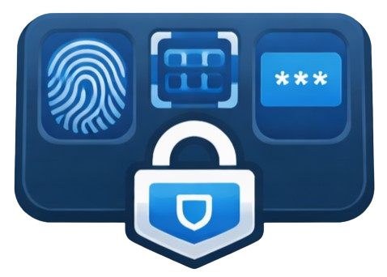

# 🔐 SecurePress

<div align="center">
  
</div>

<div align="center">
  
  
  
</div>
<p align="center">
  
  
  
  
</p>
<p align="center">
  <a href="https://github.com/sponsors/ChromuSx"></a>
  <a href="https://ko-fi.com/chromus"></a>
  <a href="https://buymeacoffee.com/chromus"></a>
  <a href="https://www.paypal.com/paypalme/giovanniguarino1999"></a>
</p>
<p align="center">
  <strong>🔐 SecurePress is a Stream Deck plugin that adds Windows Hello biometric authentication to protect sensitive actions. Lock your Stream Deck buttons behind fingerprint, facial recognition, or PIN verification - perfect for streamers and power users who need enterprise-grade security for critical operations.</strong>
</p>

## Features ✨

🔐 **Biometric Security** - Lock actions behind Windows Hello authentication (fingerprint, facial recognition, or PIN)

⚡ **Multiple Action Types:**
- 🖥️ Execute programs and applications
- ⌨️ Trigger keyboard hotkeys
- 📜 Run PowerShell and Python scripts
- 🌐 Send HTTP requests (GET, POST, PUT, DELETE)
- ✍️ Input text (paste or simulate typing)
- 🔄 Execute multi-command sequences

🎨 **Visual Feedback** - Color-coded status indicators:
- 🟢 Green badge - Authentication successful
- 🔴 Red badge - Authentication failed
- 🟠 Orange badge - Authentication in progress
- ⚪ No badge - Idle state

## Installation 📥

### From Stream Deck Marketplace
Coming soon!

### Manual Installation
1. Download the latest `com.securepress.action.streamDeckPlugin` from [Releases](https://github.com/ChromuSx/SecurePress/releases)
2. Double-click the file to install
3. The plugin will appear in Stream Deck's action list
4. Drag and drop to add it to your Stream Deck

## Quick Start 🚀

1. **Add SecurePress action** to your Stream Deck
2. **Configure the action** in the property inspector:
   - Select action type (Program, Hotkey, Script, HTTP, Text, or Sequence)
   - Fill in the required fields
3. **Press the button** on your Stream Deck
4. **Authenticate with Windows Hello** (fingerprint, face, or PIN)
5. **Action executes** after successful authentication!

## Action Types 🎯

### 💻 Execute Program
Launch applications and executables securely.
- Specify program path and optional arguments
- Perfect for opening sensitive documents or admin tools

### ⌨️ Hotkey
Trigger keyboard shortcuts that require protection.
- Supports modifiers (Ctrl, Alt, Shift, Win)
- Ideal for system commands or dangerous shortcuts

### 📜 Run Script
Execute PowerShell or Python scripts with authentication.
- Choose between PowerShell (.ps1) or Python (.py)
- Secure automation for system tasks

### 🌐 HTTP Request
Send authenticated HTTP requests.
- Support for GET, POST, PUT, DELETE methods
- Custom headers and request body
- Optional response popup

### ✍️ Text Input
Type or paste text securely.
- Simulate typing or paste from clipboard
- Optional "Press Enter" after input
- Great for passwords or sensitive data

### 🔄 Multi-Command Sequence
Chain multiple actions together.
- Execute a series of protected actions
- Combine different action types in sequence

## Requirements 🛠️

- **Operating System**: Windows 10/11
- **Stream Deck Software**: 6.4 or higher
- **Windows Hello**: Configured with fingerprint reader, facial recognition camera, or PIN

## Development 💻

### Prerequisites
- Node.js 20+
- npm
- Windows 10/11 with Windows Hello configured

### Setup
```bash
cd streamdeck-plugin
npm install
```

### Build
```bash
npm run build
```

### Package for Distribution
```bash
npm run build:package
```

### Install Locally for Testing
```bash
npm run install:local
```

See [DEVELOPMENT.md](streamdeck-plugin/DEVELOPMENT.md) for detailed development instructions.

## How It Works 🧠

SecurePress integrates Windows Hello authentication into your Stream Deck workflow:

1. **Button Press** - User presses a SecurePress button
2. **Authentication Prompt** - Windows Hello biometric prompt appears
3. **Verification** - User authenticates with fingerprint, face, or PIN
4. **Action Execution** - Configured action executes only after successful authentication
5. **Visual Feedback** - Button shows color-coded status (green/red/orange)

## Contributions 🤝

Contributions and improvements are welcome! Feel free to submit a pull request or report any issues on [GitHub Issues](https://github.com/ChromuSx/SecurePress/issues).

## Support the Project 💖

This project is completely free and open source. If you find it useful and would like to support its continued development and updates, consider making a donation. Your support helps keep the project alive and motivates me to add new features and improvements!

<div align="center">
  <a href="https://github.com/sponsors/ChromuSx"></a>
  <a href="https://ko-fi.com/chromus"></a>
  <a href="https://buymeacoffee.com/chromus"></a>
  <a href="https://www.paypal.com/paypalme/giovanniguarino1999"></a>
</div>

Every contribution, no matter how small, is greatly appreciated! ❤️

## License 📜

This project is licensed under the MIT License. See [LICENSE](LICENSE) for details.

---

<div align="center">
  Made with ❤️ by <a href="https://github.com/ChromuSx">ChromuSx</a>
</div>
